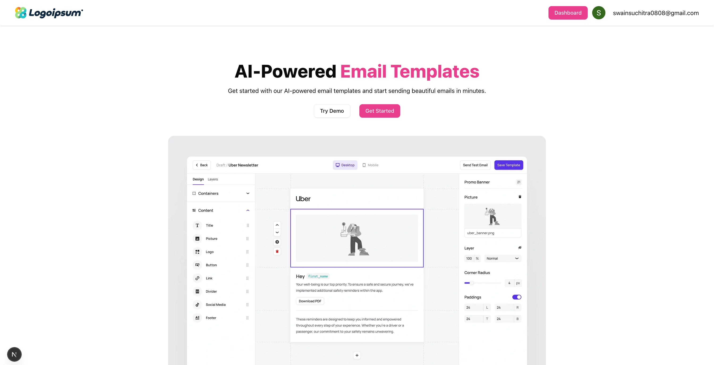

# AI Email Template Builder



This project is an AI-powered email template builder built using **Next.js, React, TailwindCSS, and Convex**. It allows users to create, customize, and send professional email templates effortlessly.

## Features

- AI-powered email template generation (via Google AI Studio)
- Drag-and-drop email editor
- Authentication via Google OAuth
- Data management using Convex
- Hosted on Vercel for fast and scalable deployment

---

## 🚀 Getting Started

### 1️⃣ Prerequisites

Ensure you have the following installed:

- [Node.js](https://nodejs.org/) (v20+ recommended)
- [npm](https://www.npmjs.com/) / [yarn](https://yarnpkg.com/) / [pnpm](https://pnpm.io/)
- Convex CLI (`npm install -g convex`)


```bash
npm run dev
# or
yarn dev
# or
pnpm dev
# or
bun dev

npx convex dev
```


